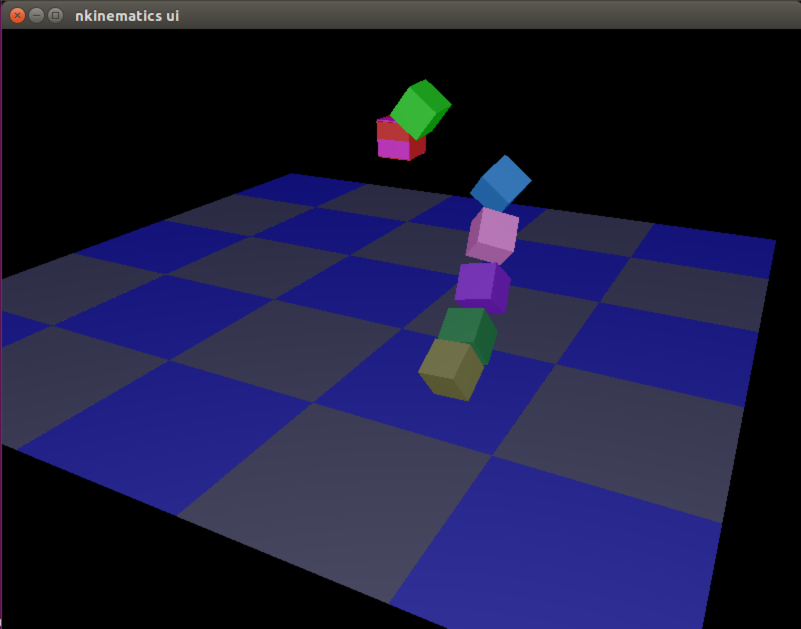
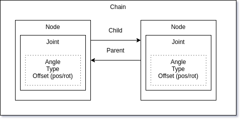
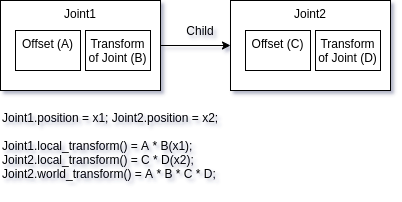

# `k`: Kinematics library for rust-lang [](https://travis-ci.org/OTL/k) [](https://crates.io/crates/k)

`k` has below functionalities.

1. Forward kinematics
1. Inverse kinematics
1. URDF Loader

`k` uses [nalgebra](http://nalgebra.org) as math library.

See [Document](http://docs.rs/k) and examples/ for more details.

API is unstable. 

## Requirements to build examples

```bash
sudo apt install g++ cmake xorg-dev libglu1-mesa-dev
```

## IK example with GUI

```bash
cargo run --release --example interactive_ik
```



Push below keys to move the end of the manipulator.

- `f`: forward
- `b`: backward
- `p`: up
- `n`: down
- `l`: left
- `r`: right
- `z`: reset the manipulator state.

## Create link tree from urdf and solve IK

```rust
use k::prelude::*;

fn main() {
    // Load urdf file
    let chain = k::Chain::<f32>::from_urdf_file("urdf/sample.urdf").unwrap();
    println!("chain: {}", chain);

    // Set initial joint angles
    let angles = vec![0.2, 0.2, 0.0, -1.0, 0.0, 0.0, 0.2, 0.2, 0.0, -1.0, 0.0, 0.0];

    chain.set_joint_positions(&angles).unwrap();
    println!("initial angles={:?}", chain.joint_positions());

    let target_link = chain.find("l_wrist_pitch").unwrap();

    // Get the transform of the end of the manipulator (forward kinematics)
    chain.update_transforms();
    let mut target = target_link.world_transform().unwrap();

    println!("initial target pos = {}", target.translation);
    println!("move z: +0.1");
    target.translation.vector.z += 0.1;

    // Create IK solver with default settings
    let solver = k::JacobianIKSolver::default();

    // Create a set of joints from end joint
    let arm = k::SerialChain::from_end(target_link);
    // solve and move the manipulator angles
    solver.solve(&arm, &target).unwrap();
    println!("solved angles={:?}", chain.joint_positions());

    chain.update_transforms();
    let solved_pose = target_link.world_transform().unwrap();
    println!("solved target pos = {}", solved_pose.translation);
}
```

## Structure of API

Top level interface is `Chain` struct. It contains `Node`s and they have the relations between nodes (parent/children).
Actual data (joint angle(position), transform between nodes) is stored in `Joint` object inside nodes.



You can get local/world transform of nodes. See below figure to understand what is the node's `local_transfrom()` and `world_transfrom()`.


